### Description 
Quiz Master is an exam preparation platform featuring multi-user support with distinct 
admin and user roles. The app enables administrators to manage subjects, chapters, 
quizzes, and questions, while users register, take quizzes, and view performance. 

### Technologies Used 
- VueJS & Bootstrap: Frontend frameworks for a responsive and unified UI. 
- Redis: In memory database for faster loading
- Celery: For caching and managing asynchronous batch jobs (CSV export). 
- Flask: Lightweight backend framework for REST APIs and role-based authentication. 
- SQLite: Relational database for data storage. 
- Chart.js: For creating charts for user and administrator.

### Screenshot

`Home Page`

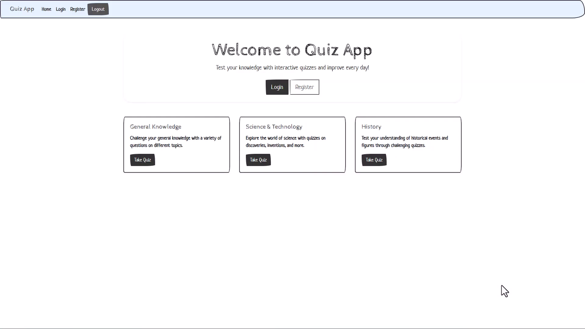

`Login Page`

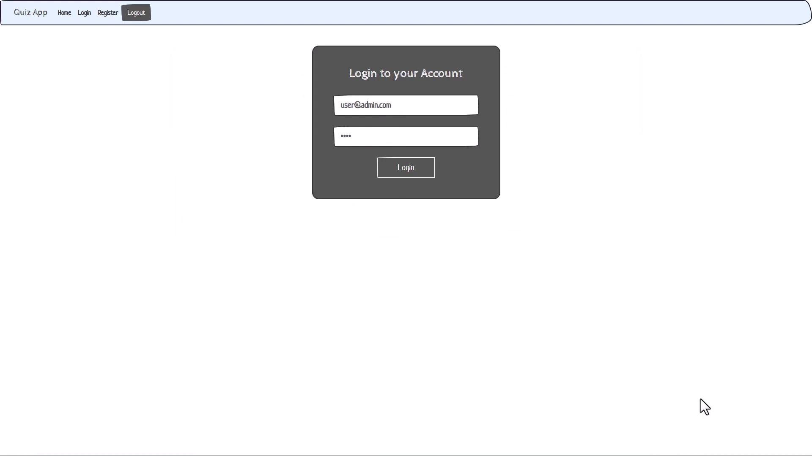

`Subject Page`

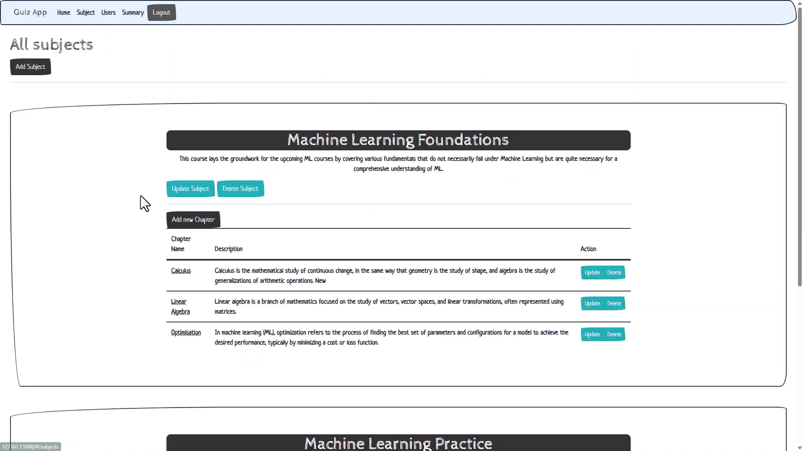

`Admin Quizzes Page`

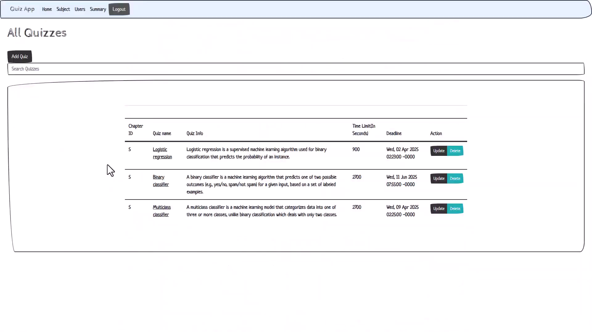

`Search Functionality`

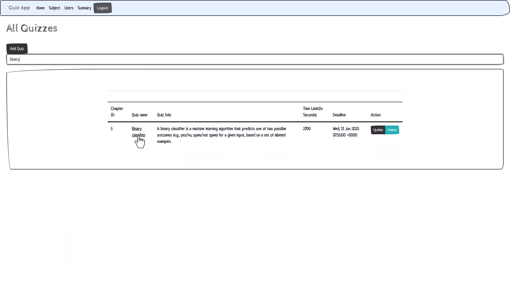

`Questions Page`

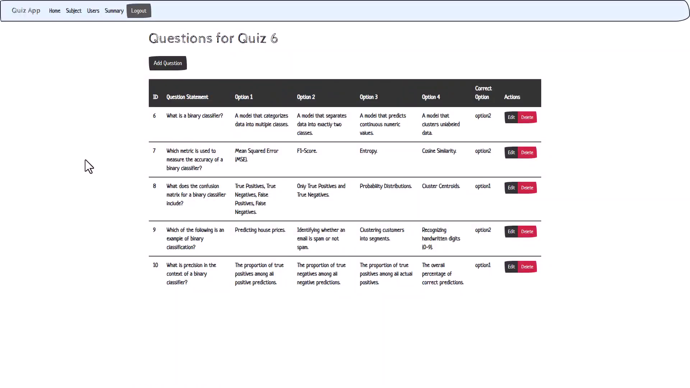

`User Page`

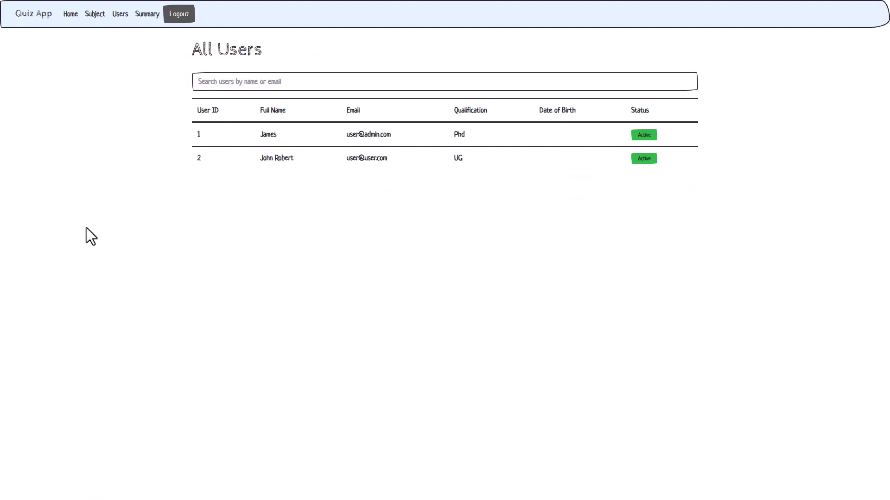

`Admin Dashboard`

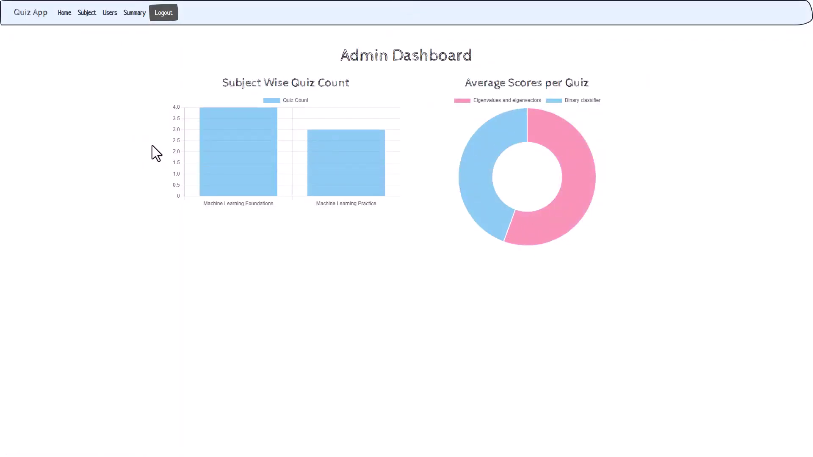

`Quizzes`

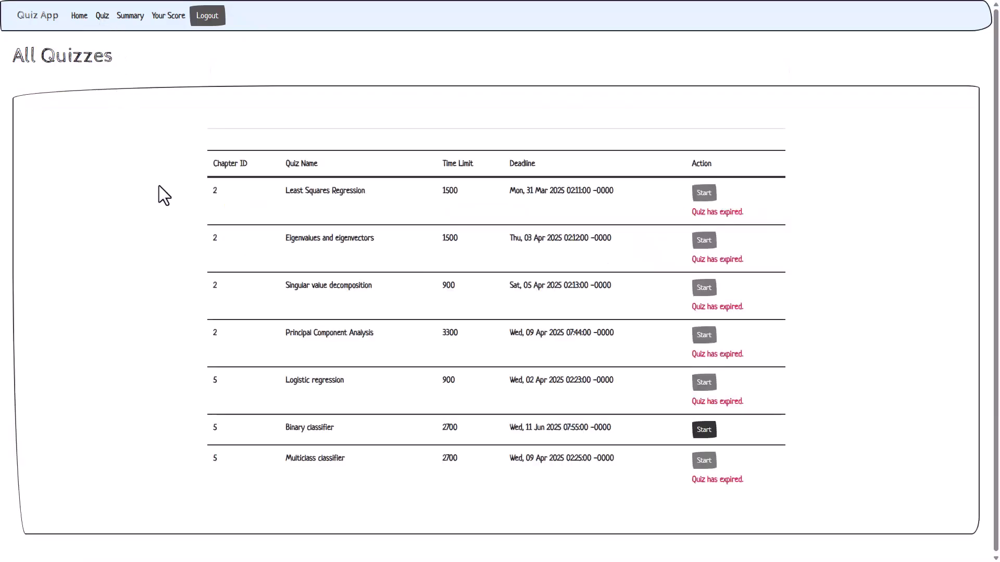

`Correct Answer Quiz`

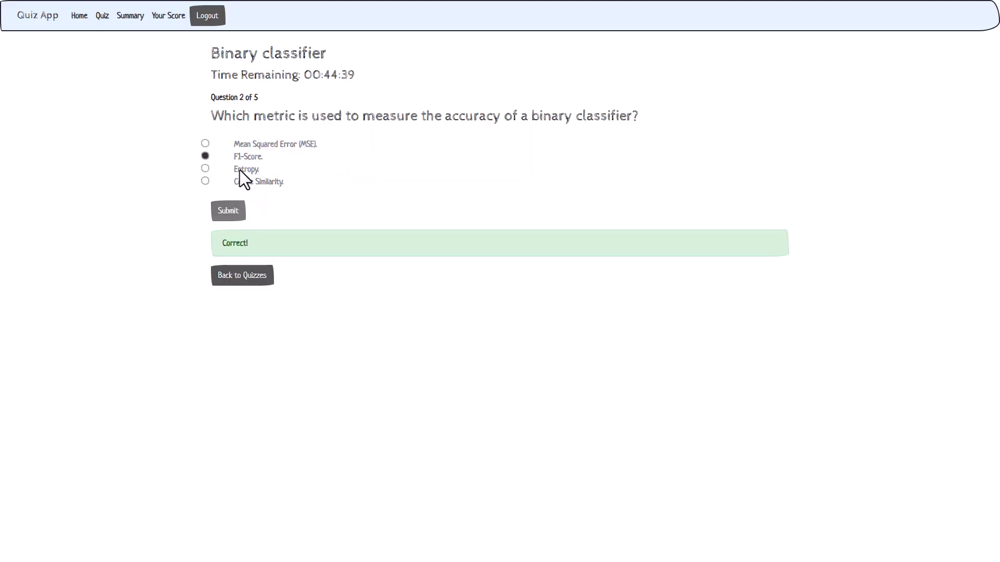

`Wrong Answer Quiz`

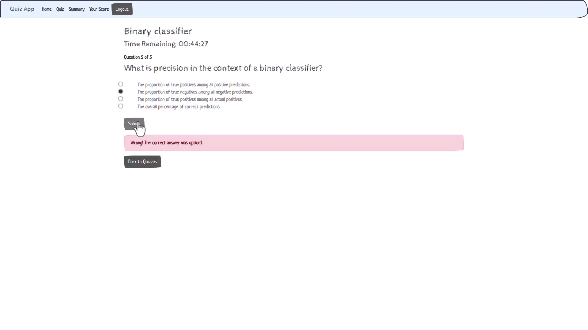

`Quiz Result Page`

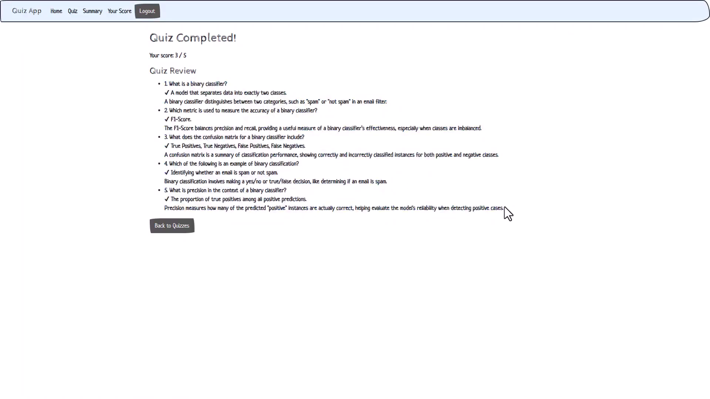

`Score Page`

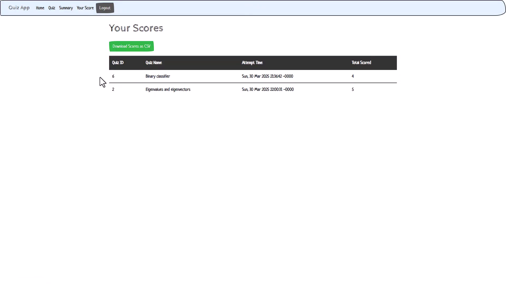

`Export Result`

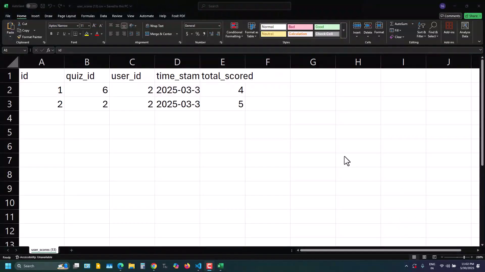

`User Dashboard`

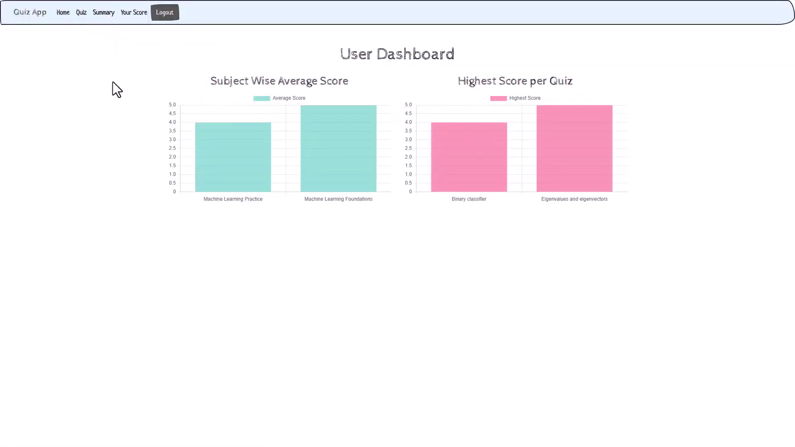

### API Design 
The project implements flask api endpoints for: 
- Authentication: User registration and login (with role management). 
- Content Management: Admin endpoints for creating, editing, and deleting subjects, 
chapters, quizzes, and questions. 
- Quiz Execution & Scoring: User endpoints to start quizzes, view questions (with 
timers), and record scores. 
- Batch Jobs: Endpoints to trigger CSV export jobs. 
 

### Architecture and Features 
The project follows a modular design: 
- Controllers/Routes: Encapsulated in dedicated Flask blueprints for authentication, 
admin functions, and quiz functionalities. 
- Templates: Bootstrap Templates serve the landing page; the main UI is driven by 
VueJS with Bootstrap styling. 
- Background Jobs: Managed using Celery and Redis, ensuring non-blocking 
processing for reminders and reports. 

### Features: 
- Role-based access control and session. 
- User and administrator summary dashboard. 
- Asynchronous CSV export and activity reporting. 
- Responsive UI with client- and server-side validations. 
  

## How to run project
#### Go to terminal
#### Run `pip install requirements.txt`
#### Run `python app.py`

## How to run celery
#### Go to Bash
#### Run `source .venv/Scripts/activate`
#### Run `celery --app=app.celery_app worker --pool=solo -l INFO`

